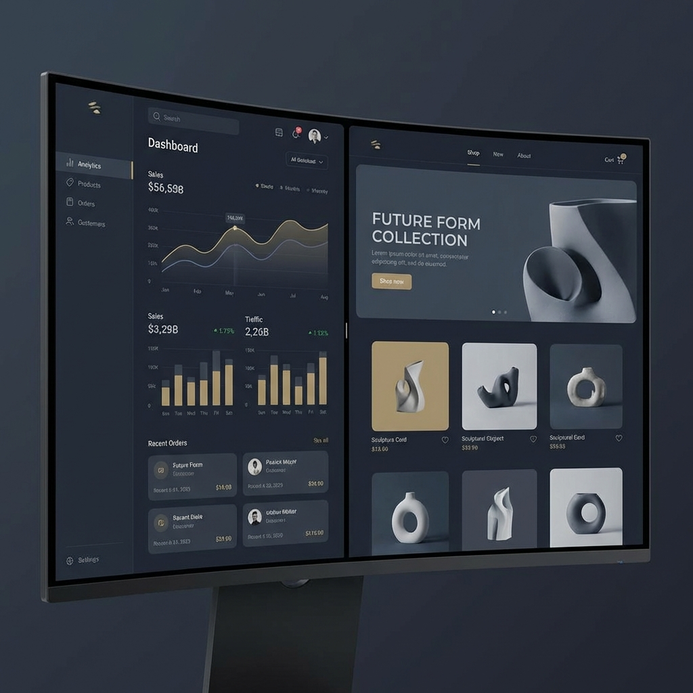

# 🛒 Full-Stack E-Commerce Platform



[](https://nextjs.org/)
[](https://reactjs.org/)
[](https://tailwindcss.com/)
[](https://github.com/pmndrs/zustand)
[](https://www.typescriptlang.org/)

A premium, full-featured e-commerce application built with **Next.js 15**, **React 19**, and **Tailwind CSS**. This platform provides a seamless shopping experience for customers and a powerful management dashboard for administrators.

---

## ✨ Key Features

### 🛍️ Storefront (Customer-Facing)
- **Modern UI/UX**: Clean, responsive, and minimalist design optimized for all devices.
- **Product Discovery**: Advanced category filtering, searching, and sorting.
- **Shopping Cart**: Real-time cart management powered by Zustand.
- **Checkout Flow**: Streamlined multi-step checkout with validation.
- **User Dashboard**: Order history, profile management, and persistent session support.
- **Interactive Components**: Dynamic carousels, hover effects, and smooth transitions.

### 🛡️ Admin Dashboard (Management)
- **Analytics Overview**: High-level sales and traffic metrics using Recharts.
- **Product Management**: Full CRUD operations for products, including image uploads and descriptions.
- **Order Management**: Track and update order statuses in real-time.
- **User Control**: Manage registered customers and permissions.
- **Content Management (CMS)**: Edit landing pages, blog posts, and site settings directly from the dashboard.

---

## 🚀 Tech Stack

- **Core**: Next.js 15 (App Router), React 19, TypeScript
- **Styling**: Tailwind CSS, Shadcn UI, Lucide React (Icons)
- **State Management**: Zustand (Client-side), React Context
- **Forms & Validation**: React Hook Form, Zod
- **Animations**: Framer Motion / Tailwind Animate
- **Charts**: Recharts
- **Deployment**: Vercel Ready

---

## 🛠️ Getting Started

### 1. Clone the repository
```bash
git clone https://github.com/AtaNu29/fullstack-ecom-app.git
cd fullstack-ecom-app
```

### 2. Install dependencies
```bash
npm install
# or
pnpm install
```

### 3. Environment Setup
Create a `.env.local` file in the root directory and add your configuration variables:
```env
NEXT_PUBLIC_API_URL=your_api_url
DATABASE_URL=your_database_url
# Add other necessary keys
```

### 4. Run the development server
```bash
npm run dev
```
Open [http://localhost:3000](http://localhost:3000) to view the storefront.
Access the admin panel at [http://localhost:3000/admin](http://localhost:3000/admin).

---

## 📂 Project Structure

```text
├── app/                 # Next.js App Router (Pages & Layouts)
│   ├── (auth)/          # Authentication routes
│   ├── (storefront)/    # Customer-facing routes
│   └── admin/           # Dashboard routes
├── components/          # Reusable UI components
├── hooks/               # Custom React hooks
├── lib/                 # Utility functions and shared logic
├── public/              # Static assets (images, fonts)
├── styles/              # Global CSS and Tailwind configurations
└── package.json         # Project dependencies and scripts
```

---

## 🤝 Contributing

Contributions are welcome! Please feel free to submit a Pull Request.

1. Fork the Project
2. Create your Feature Branch (`git checkout -b feature/AmazingFeature`)
3. Commit your Changes (`git commit -m 'Add some AmazingFeature'`)
4. Push to the Branch (`git push origin feature/AmazingFeature`)
5. Open a Pull Request

---

## 📄 License

Distributed under the MIT License. See `LICENSE` for more information.

---

Developed by [AtaNu](https://github.com/AtaNu29)
